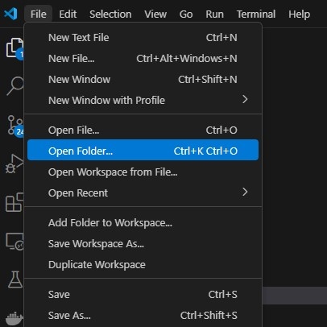
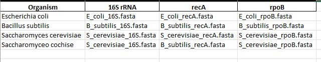

# MLSA-pipeline
This is the public repository to hold the code for the MLSA-pipeline software. This software was developed as part of a graduation thesis in bioinformatics at Universidad del Valle de Guatemala.

## Purpose
Provide a simple way to run Multi Locus Sequence Analysis which is a molecular biology method used to determine the evolutionary relationships and genetic diversity of organisms, typically microorganisms. It involves analyzing the sequences of multiple conserved genes (loci) across a set of organisms to infer their phylogeny.

## How does it work?
MLSA-pipeline leverages the benefits of containerized software using Docker to provide an easy interface into a linux machine with preinstalled MLSA tools in three main categories: 
1. Alignment
2. Concatenation
3. Phylogenetic inference

## User Manual
This software was designed to provide easy installation of various tools and a predeveloped pipeline using Snakemake and python. It is recommendend that users have a basic understanding of what a computer terminal is, as well as some basic understanding of installing and uninstalling software in a computer for this project to work.

### Prerequisites
Users should install or make sure these things are enabled on their computer before starting the project (assuming you have a windows machine, else skip the installation of first step):
1. Windows Linux Subsystem (WSL): [Official documentation](https://learn.microsoft.com/en-us/windows/wsl/install)
2. Docker: [Official documentation](https://docs.docker.com/desktop/setup/install/windows-install/)
3. A visual code editor that you feel comfortable with (VS Code recommended) [Official download](https://code.visualstudio.com/download)
4. Git (Optional) [Official download](https://git-scm.com/downloads)

### Installation process
In order to install the program you need to download the repository by either performing a manual download and extraction of the directory or cloning the repository into your machine using git:

`git clone https://github.com/Rafalp190/MLSA-pipeline.git`

Once the repository is cloned into your machine we recommend opening the folder MLSA-pipeline as a project folder in VSCODE

The next step is to build the container (make sure you have the docker daemon running on your computer):
The most simple command is:

`docker build -t mlst-pipeline .`

This will create an image of the container in your computer. **Please note that this process requires a connection to the internet as software needs to be downloaded**. If the build process fails make sure you have an internet connection and that docker is properly installed. If you wish to see additional information on what is being installed, the dockerfile is part of the folder sturcture downloaded on git.

Once the pipeline has been build you can perform a test run with the example data provided to make sure everything is working correctly. For this you can use the following command:

`docker run -v <project_path(absolute path)>/mnt:/mnt -p 3838:8000 -it mlst-pipeline`

What this does is mount the /mnt/ folder that comes with your project into the container, and assigns the container port to the 3838 port of your machine. If the process runs correctly you will be able to open the following URL:

[http://localhost:3838/](http://localhost:3838/)

And see the results dashboard of the test run. 

This means you have sucessfully installed the application and can start configuring your run. Make sure to replace the **path of your file system** to be able to run the command. These commands can be run inside of the terminal that comes with VS code or inside a terminal that is currently set at your root project directory. 

### Inputting your data

After you have sucessfully run your project you can start inputting your data into the /mnt/ directory of the project. This can be done from the windows file system to ease the process. Here there are 3 main things to modify.

1. **data/seq/ directory**: In the seq directory you have to add all of the sequences that you will utilize for the project in **fasta** format. 
2. **data/input.xlsx**: this input file is the most important part of the process. Here you have to specify the names of the organisms (or identifiers you want to use to refer to them) in the first column and each subsequent column corresponds to a each **locus** of analysis. Per locus you have to add in each of the cells the name of the file corresponding to it inside the **seq/** directory.

3. **config.yaml**: this input file contains all of the configurations required to perform a run on the project. By default it makes a short run using ClustalW, seqkit and MRBayes. However, you can modify the parameters to use other tools or customize parameters specific to each of the tools. Inside the config file you will find detailed comments on how to use it and links to references for the functions implemented in the software in case you want to modify any of the parameters that come from the tool.

### Before you run the code again

Make sure to delete the **mnt/output/** folder created from the dummy run. This will set up the environment again for you to be able to run from scratch. This is a process that you have to perform every single time you wish to re run as the process checks for the existance of outputs in the folders to decide which steps need re running. These outputs depend on the name of the **loci** in the output file and also on general log files.

If you understand more of the process you can delete outputs individually in case you want to skip running the alignment you can maintain the **output/aligned** folder and so on. This should reduce the time it takes to get to another result. Especially if you are confident that the alignment was performed correctly. We recommend just deleting the whole folder if you don't feel comfortable deleting individual files **so the process restarts from scratch**. If you wish to perform multiple runs without deleting your previous output, simply renaming the **output/** folder to anything else will make the process restart from scratch. 

### Running your analysis 

To run your analysis you do not need to build the container again. Just run it, so you can use the command:

`docker run -v <project_path(absolute path)>/mnt:/mnt -p 3838:8000 -it mlst-pipeline`

### Debugging

If you run into execution errors you can always use the information displayed on the terminal to check what failed. It will point towards the appropriate execution logfile available in **output/logs/** to be able to check the error of the tool selected. 

### Learn more about the project

The full project implementation thesis is available inside this directory in the file **Thesis 2024.pdf** in spanish. This expains the process taken to implement the software and provides additional details on the tools implemented. 